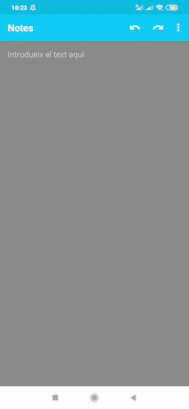

# LocalSTT

(Jump to [English](#English))

### [Català]

> **Nota: Aquesta aplicació de moment només és una prova de concepte**

LocalSTT és una aplicació per Android que proporciona reconeixement automàtic de la parla sense necessitat de conexió a internet ja que tot el processament és local al mòbil.

Això és possible gràcies a:
- un RecognitionService que utilitza la llibreria de Vosk
- un RecognitionService que utilitza la lliberia de Mozilla Deepspeech
- una Activity que gestiona intents RECOGNIZE_SPEECH entre altres

El codi és actualment una prova de concepte i es basa fortament en els següents projectes:
- [Kõnele](https://github.com/Kaljurand/K6nele)
- [Vosk Android Demo](https://github.com/alphacep/vosk-android-demo)

LocalSTT hauria de funcionar amb la majoria de teclats i aplicacions que implementen la funció de reconeixement de veu a través d'un intent RECOGNIZE_SPEECH o directament fent servir la classe SpeechRecognizer d'Android. Ha estat provada amb èxit fent servir les següent aplicacions en un terminal Android 9:
- [AnySoftKeyboard](https://github.com/AnySoftKeyboard/AnySoftKeyboard)
- [Kõnele](https://github.com/Kaljurand/K6nele)
- [SwiftKey](https://www.swiftkey.com)

Us podeu descarregar un APK que inclou models de Vosk i DeepSpeech pel català [aquí](https://github.com/ccoreilly/LocalSTT/releases/download/2020-12-03/localstt.apk).

### [English]

> **Note: This application is just a proof of concept for now**

LocalSTT is an Android application that provides automatic speech recognition services without needing internet connection as all processing is done locally on your phone.

This is possible thanks to:
- a RecognitionService wrapping the Vosk library
- a RecognitionService wrapping Mozilla's DeepSpeech library
- an Activity that handles RECOGNIZE_SPEECH intents amongst others

The code is currently just a PoC strongly based on:
- [Kõnele](https://github.com/Kaljurand/K6nele)
- [Vosk Android Demo](https://github.com/alphacep/vosk-android-demo)

LocalSTT should work with all keyboards and applications implementing speech recognition through the RECOGNIZE_SPEECH intent or Android's SpeechRecognizer class. It has been successfully tested using the following applications on Android 9:
- [AnySoftKeyboard](https://github.com/AnySoftKeyboard/AnySoftKeyboard)
- [Kõnele](https://github.com/Kaljurand/K6nele)
- [SwiftKey](https://www.swiftkey.com)

You can download a pre-built binary with Vosk and DeepSpeech models for catalan [here](https://github.com/ccoreilly/LocalSTT/releases/download/2020-12-03/localstt.apk).

If you want to use the application with your language just replace the models in `app/src/main/assets/sync` and rebuild the application.

### Demo

